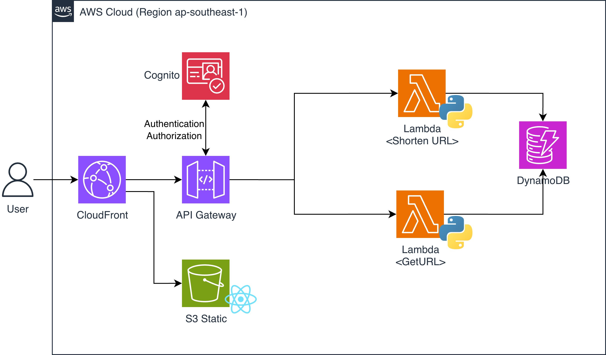

# Udemy DevOps Course – Final Assignment 2

This project implements a **serverless URL shortening service** using AWS. The system allows users to generate short links from full URLs and redirect to the original URLs seamlessly. It leverages **Lambda functions**, **API Gateway**, **DynamoDB**, **S3**, and **CloudFront**, with IAM roles following the **Least Privilege Principle**. The architecture is fully modular, scalable, and designed to support a modern CI/CD deployment workflow.

## High-Level Design

  

## Modules

- `/api`: Configures **API Gateway** to proxy requests to Lambda functions based on paths, with permissions defined according to the _Least Privilege Principle_.
- `/cdn`: Configures a **CloudFront distribution** to route static site traffic to S3 and API requests to API Gateway.
- `/database`: Defines a **DynamoDB table** to store mappings between short links and full URLs.
- `/lambda_generator`: Packages and configures the **Lambda function** that generates a short link from a full URL.
- `/lambda_link`: Packages and configures the **Lambda function** that retrieves the full URL from a short link and redirects users.
- `/security`: Defines **IAM roles and policies** for all components, following the _Least Privilege Principle_.
- `/static_site`: Provisions an **S3 bucket** for hosting the static frontend (Vite.js) site.
